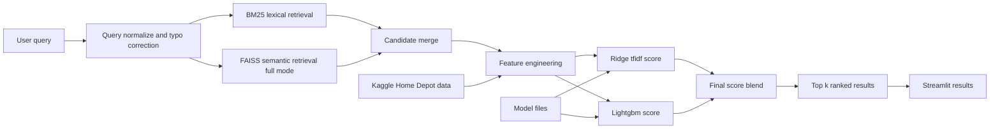
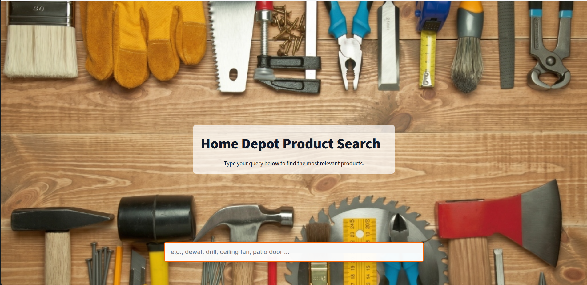
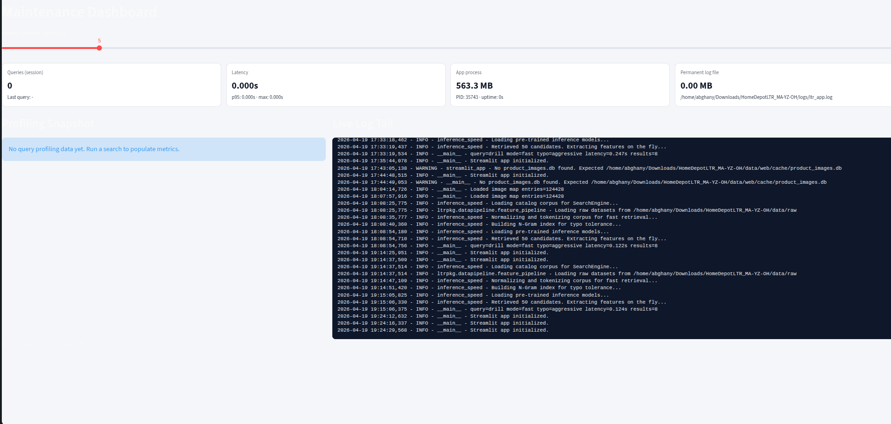
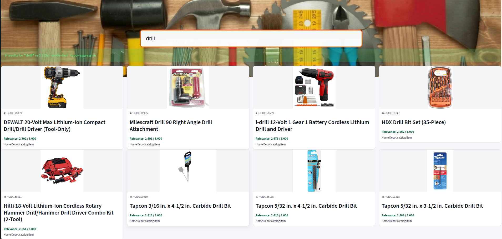

# Introduction

This project is a practical experiment in building a Learning-to-Rank (LTR) search experience on the Kaggle Home Depot Product Search Relevance dataset. It is designed to make search results feel more useful by promoting products that better match user intent.

Technically, it is a Home Depot LTR app with a Streamlit UI, package-first code layout (`ltrpkg`), and offline product-image cache support. The ranking flow uses a fast retrieval + reranking pipeline.

### Architecture



### Feature engineering and ranking (from code)

The ranking stack is implemented in `inference.py` (full mode) and `inference_speed.py` (fast mode), with corpus prep in `ltrpkg/datapipeline/feature_pipeline.py`.

1. **Corpus + normalization**
   - Merges `train.csv`, `product_descriptions.csv`, and `attributes.csv`.
   - Builds normalized fields: `product_title_norm`, `product_description_norm`, `all_attributes_norm`, `brand_norm`.
2. **Candidate retrieval**
   - BM25 on title+description tokens.
   - Char n-gram BM25 for typo tolerance.
   - Full engine also adds semantic recall via SentenceTransformer + FAISS (`products.index`).
3. **On-the-fly feature engineering**
   - Query/document length and ratio features.
   - Exact/brand/last-word/number matches.
   - Positional stats (min/mean/max hit positions).
   - Overlap, coverage, and Jaccard features across title/description/attributes.
   - BM25 scores by field (title/description/attributes).
   - TF-IDF dot-product similarities and LSA similarities (word + char spaces).
   - SentenceTransformer cosine-style similarity signals (title/description).
4. **Ridge TF-IDF meta-model**
   - Concatenates `query [SEP] title [SEP] description [SEP] brand`.
   - Vectorizes with `models/tfidf_vectorizer.pkl`.
   - Predicts with `models/ridge_model.pkl`.
   - Stores this as `score_ridge_tfidf`.
5. **Final ranking**
   - LightGBM predicts from engineered features (`lgbm_model*.txt`, `lgbm_features*.json`).
   - Final score is blended: `0.8 * LightGBM + 0.2 * Ridge`.

### Screenshots




## Getting Started

### Installation process

1. Create and activate a virtual environment:

```bash
python3 -m venv .venv
source .venv/bin/activate
```

2. Install project dependencies:

```bash
pip install -r requirements.txt
```

### Software dependencies

- Python 3.x
- Packages listed in `requirements.txt`
- Streamlit for the UI

### Latest releases

No formal tagged release workflow is documented yet. Use the latest code in this repository.

### API references

No external/public API reference is published for this project. The main entry points are:

- `streamlit_app.py` (UI application)
- `inference.py` / `inference_speed.py` (search engines)
- `ltrpkg/` (core package modules)

### Package structure

```text
ltrpkg/
├── policy/
├── datapipeline/
├── models/
├── config/
└── utils/
```

### Dataset setup

Download the Home Depot Product Search Relevance dataset from Kaggle and place files under `data/raw/`.

Expected files:

```text
data/raw/
├── train.csv
├── test.csv
├── attributes.csv
└── product_descriptions.csv
```

### Build/download product image cache

Run from repository root:

```bash
python scripts/build_offline_image_db.py --data-dir data/raw
```

This generates:

```text
web/cache/product_images.db
web/cache/images/
```

Then sync cache into the app path expected by `streamlit_app.py`:

```bash
mkdir -p data/web/cache
rsync -a web/cache/product_images.db data/web/cache/product_images.db
rsync -a web/cache/images/ data/web/cache/images/
```

## Build and Test

### Run the app

```bash
source .venv/bin/activate
streamlit run streamlit_app.py --server.port 8501 --server.headless true
```

Open `http://127.0.0.1:8501`.

### Test status

No dedicated automated test command is documented yet in this repository.

### Logging

- Logging uses `ltrpkg.utils.logging`.
- Default log file: `logs/ltr_app.log`.
- Optional path overrides:
  - `LTR_BASE_DIR`
  - `LTR_DATA_DIR`
  - `LTR_MODELS_DIR`
  - `LTR_LOGS_DIR`
  - `LTR_APP_LOG_FILE`

## Contribute

Contributions are welcome. To contribute:

1. Fork the repository and create a feature branch.
2. Keep changes focused and aligned with the existing project structure (`ltrpkg/`, scripts, and Streamlit app).
3. Open a pull request with a clear description of what changed and why.
